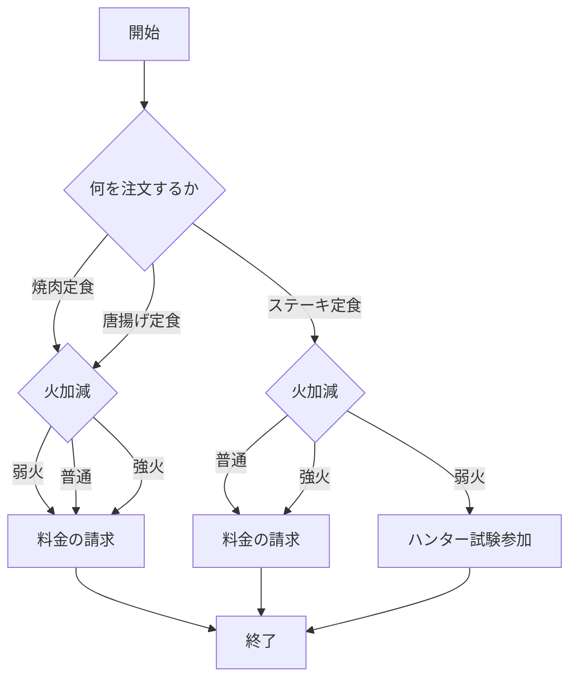
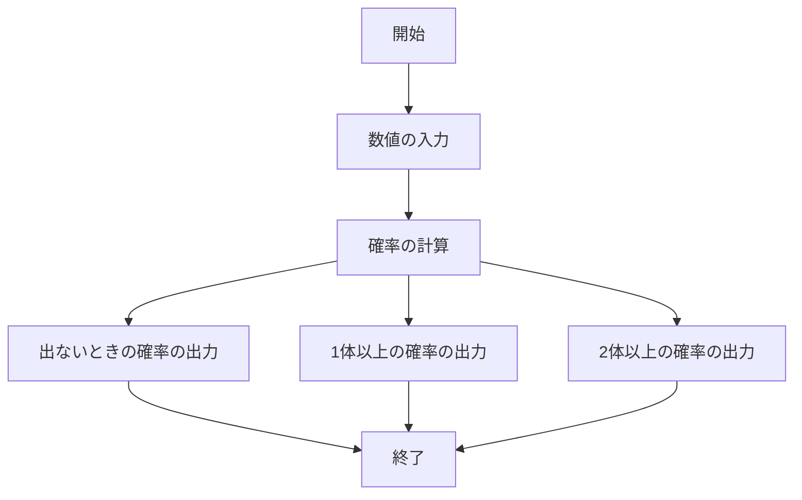

# webpro_06
2024/11/17

## ファイル一覧
ファイル名 | 説明
-|-
app5.js | プログラム本体
teisyokuya.ejs | 定食屋のテンプレートファイル
gacha.ejs | ガチャの確率計算のテンプレートファイル

##　定食屋のフローチャート

```mermaid
flowchart TD;

start["開始"];
end1["料金の請求"]
end11["料金の請求"]
end2["ハンター試験参加"]
end3["終了"]
if1{"何を注文するか"}
if2{"火加減"}
ura1{"火加減"}

start --> if1
if1 -->|焼肉定食| if2
if1 -->|ステーキ定食| ura1
if1 -->|唐揚げ定食| if2
if2 -->|弱火|end1
if2 -->|普通|end1
if2 -->|強火|end1
ura1 -->|弱火|end2
ura1 -->|普通|end11
ura1 -->|強火|end11
end1 --> end3
end11 --> end3
end2 --> end3
```
##　ガチャの確率計算のフローチャート

```mermaid
flowchart TD;

start["開始"];
end1["終了"]
if["数値の入力"]
keisan["確率の計算"]
syu0["出ないときの確率の出力"]
syu1["1体以上の確率の出力"]
syu2["2体以上の確率の出力"]


start --> if
if --> keisan
keisan --> syu0
keisan --> syu1
keisan --> syu2
syu0 --> end1
syu1 --> end1
syu2 --> end1
```