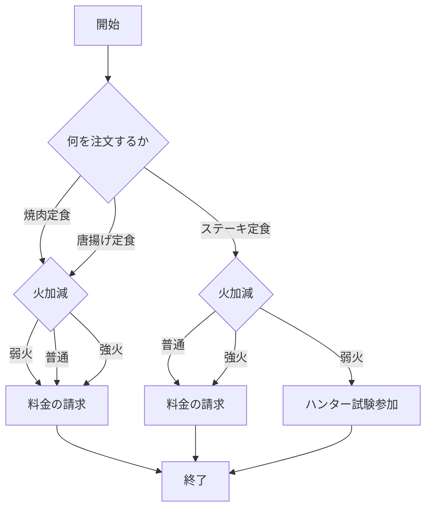
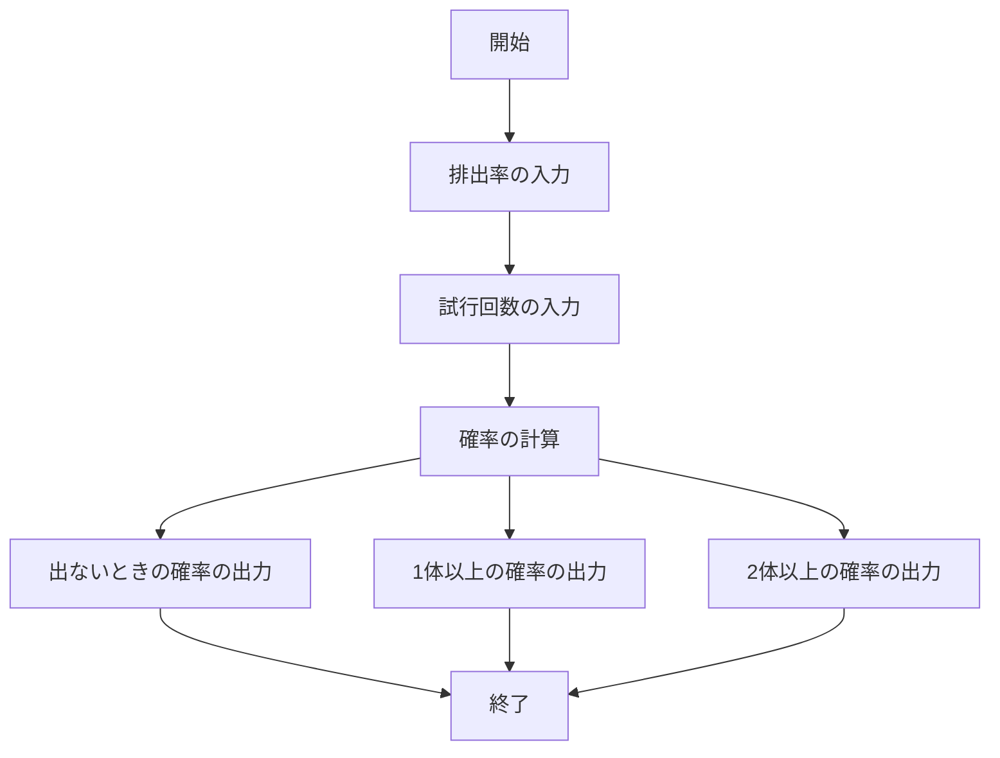

# webpro_06
2024/11/17

## ファイル一覧
ファイル名 | 説明
-|-
app5.js | プログラム本体
teisyokuya.ejs | 定食屋のテンプレートファイル
gacha.ejs | ガチャの確率計算のテンプレートファイル


## 起動方法
1. ターミナルを開く．
1. 下記のように，cdコマンドでapp5.jsまた，同時に扱う他のhtmlファイルやejsファイルのあるディレクトリに移動する．
    ```javascript
    cd webpro_06
    ```
1. nodeコマンドを使用してapp5.jsを起動する．
    ```javascript
    node app5.js
    ```
1. WebブラウザのURL欄に下記のURLを入力しページを表示する．
    ```javascript
    http://localhost:8080/teisyokuya
    http://localhost:8080/gacha
    ```

## 編集したファイルをGitで管理する
1. ターミナルを開く．
1. 下記のように，cdコマンドでapp5.jsまた，同時に扱う他のhtmlファイルやejsファイルのあるディレクトリに移動する．
    ```javascript
    cd webpro_06
    ```
1. 下記のコマンドを順に入力する．コメントには変更理由や変更内容を書く．
    ```javascript
    $ git add .
    $ git commit -am 'コメント'
    $ git push
    ```

## 定食屋

###　機能の説明
このプログラムの使用者は定食屋で定食の注文と調理するときの火加減を指示できる．
定食，火加減はそれぞれ３つの選択肢が用意されており，定食では焼肉定食・ステーキ定食・唐揚げ定食．火加減では弱火・普通・強火が選択できる．
選んだ選択肢によってそれぞれの料金の請求や秘密の出力がされる．

###　使用するための手順
1. 定食と火加減を３択の中から１つ選択する．
2. 送信を押す．

###　フローチャート

##　ガチャの確率計算
###　機能の説明

このプログラムはガチャを引くにあたって，ガチャを引く回数に対する目当てのものを引ける確率を計算するプログラムである．
出力する確率は，目当てのものが引けない確率・１つ以上引ける確率・２つ以上引ける確率の３つである．

###　使用するための手順

1. 排出率と試行回数（ガチャを引く回数）を入力する．
2. 送信を押す．

###　フローチャート



## 定食屋