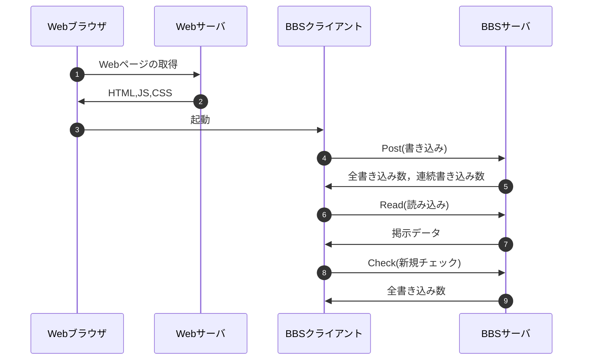

# webpro_06
2024/11/17

## ファイル一覧
ファイル名 | 説明
-|-
app8.js | サーバーの方
bbs.js | クライアントの方
bbs.html | HTMLファイル


## 起動方法
1. ターミナルを開く．
1. 下記のように，cdコマンドでapp5.jsまた，同時に扱う他のhtmlファイルやejsファイルのあるディレクトリに移動する．
    ```javascript
    $ cd webpro_06
    ```
1. nodeコマンドを使用してapp8.jsを起動する．
    ```javascript
    $ node app8.js
    ```
1. telnetコマンドを使用しポートに接続する
    ```javascript
    $ telnet localhost 8080
    ```
1. 扱いたいプログラムを選択する．
    ```javascript
    GET /"扱うプログラム名" HTTP/1.1
    Host: localhost
    ```
1. WebブラウザのURL欄に下記のURLを入力しページを表示する．
    ```javascript
    http://localhost:8080/bbs.html
    ```

## 編集したファイルをGitで管理する
1. ターミナルを開く．
1. 下記のように，cdコマンドでapp5.jsまた，同時に扱う他のhtmlファイルやejsファイルのあるディレクトリに移動する．
    ```javascript
    $ cd webpro_06
    ```
1. 下記のコマンドを順に入力する．コメントには変更理由や変更内容を書く．
    ```javascript
    $ git add .
    $ git commit -am 'コメント'
    $ git push
    ```

## 仕様①連続投稿数のカウント

### 仕様の説明
同じ名前の人が連続して投稿をすると何回連続して投稿しているかをカウントすることができる．
名前を変更するとカウントが１に戻り再度カウントを開始する．

### 使用するための手順
1. 名前とメッセージを入力し，送信ボタンを押す．
2. 画面上部で連続投稿数がカウントされる．

### シーケンス


## 仕様②再投稿ボタン
### 機能の説明
1つ前の投稿を再度投稿する事ができる.
再投稿では1つ前の投稿と名前とメッセージが全く同じ投稿が行われる.
1つ前の投稿がない場合，名前とメッセージの無い投稿が行われる.


### 使用するための手順
1. 名前とメッセージを入力し何らかの投稿をする．
2. 送信ボタンの右にある再投稿ボタンを押す．
3. 1.で投稿した投稿が再投稿される．

### シーケンス


## 仕様③絵文字ボタン
### 機能の説明
メッセージの入力に関係なく絵文字をメッセージとして投稿することができる．

### 使用するための手順

1. 名前を入力する．
2. 再投稿ボタンの右にある絵文字ボタンを押す．
3. 入力した名前で絵文字が投稿される．

### シーケンス

